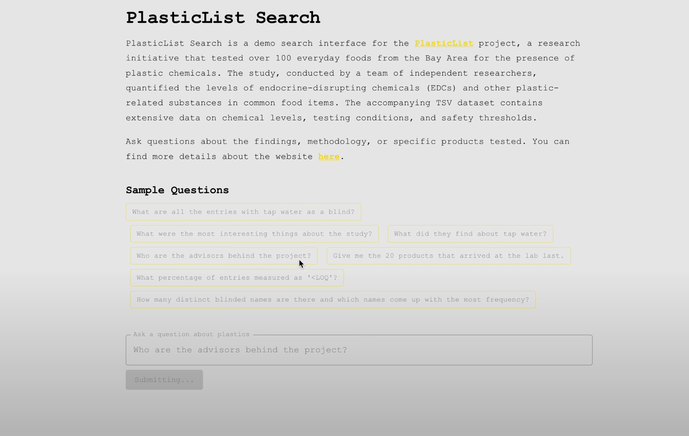
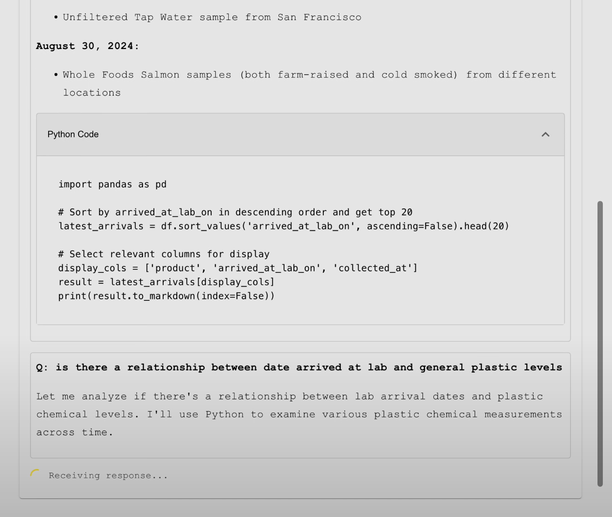
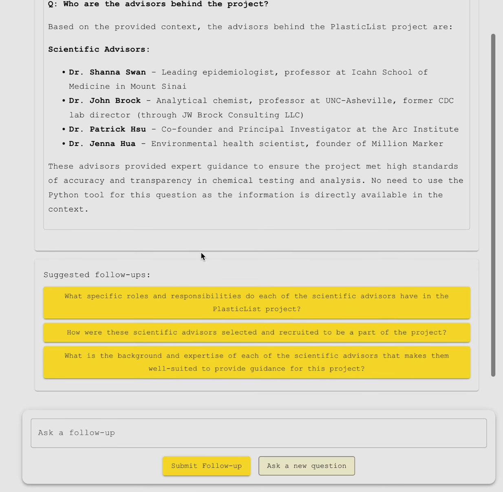

# PlasticList Search

_Note_: PlasticList Search is now deprecated due to api costs.

[PlasticList]((https://frontend-ten-lac-57.vercel.app/)) Search is a search interface for the [PlasticList](https://www.plasticlist.org/) project, a research initiative that tested over 100 everyday foods from the Bay Area for the presence of plastic chemicals. Use it to explore the comprehensive dataset and query detailed information about plastic chemicals in your favorite foods.

PlasticList Search is built with **Next.js 15** and **Material-UI** for a responsive frontend and leverages **FastAPI**, **Python**, and **Supabase** for the backend.

## Nice Features

- **Retrieval-Augmented Generation (RAG):** Utilizes the Voyage-3-Large model and Anthropic’s [embeddings](https://docs.anthropic.com/en/docs/build-with-claude/embeddings) for sophisticated context retrieval from relevant documents and TSV data.
  
- **Anthropic Tool Use:** Implements Anthropic's [tool use](https://docs.anthropic.com/en/docs/build-with-claude/tool-use) to run Python Pandas queries on the TSV dataset, enabling users to perform complex data manipulations and analyses directly through the search interface.

- **Persistent Conversation History:** Maintains a history of user interactions, allowing for seamless continuation of queries and discussions. Also supports automatically generated follow-up queries.

- **Code Boxes:** Provides code snippets and structured responses for better clarity and usability.

## Screenshots

  

  

  

